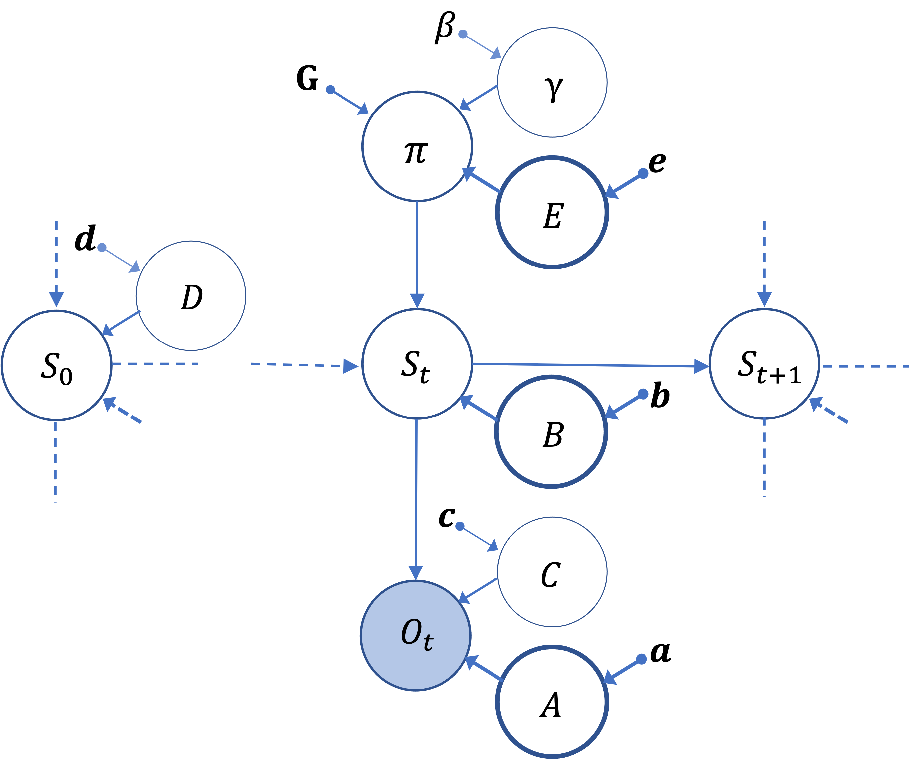

# Active Inference
Active Inference agents implement perception and action planning through the minimization of variational free energy [[1]](#1). To minimize free energy, the agents use a generative model of the causes of their perceptions, which encodes the joint probability of the stochastic variables illustrated in Fig. $1$, using the formalism of probabilistic graphical models [[2]](#2). 

<figure>
  Figure 1.</figcaption>
</figure>

&nbsp;

The agent's generative model is defined as follows:
```math
\begin{align}
& 
\hspace{-1em}
P\left(o_{0:T},s_{0:T},u_{1:T},\gamma|\boldsymbol{\Theta}\right)=\nonumber \\
& 
\hspace{-1em}
P\left(\gamma|\boldsymbol{\Theta}\right)
P\left(\pi|\gamma,\boldsymbol{\Theta}\right)
P\left(s_{0}|\boldsymbol{\Theta}\right)
\prod_{t=0}^{T}
P\left(o_{t}|s_{t},\boldsymbol{\Theta}\right)
P\left(s_{t+1}|s_{t},\pi_{t},\boldsymbol{\Theta}\right)
\label{}
\end{align}
```
where

$P\left(o_{t}|s_{t},\boldsymbol{\Theta}\right)=\mathbf{A}$, 
${P\left(s_{t+1}|s_t,\pi_t,\boldsymbol{\Theta}\right)=\mathbf{B}\left(u_t=\pi_t\right)}$, 
${P\left(\pi_t|\gamma,\boldsymbol{\Theta}\right)=\sigma\left(\ln\mathbf{E}\gamma\cdot\mathbf{G}\left(\pi_t\right)|\boldsymbol{\Theta}\right)}$, 
$P\left(\gamma,\boldsymbol{\Theta}\right)\sim\Gamma\left(\alpha,\beta\right)$, and
$P\left(s_0|\boldsymbol{\Theta}\right)=\mathbf{D}$.

The set $\boldsymbol{\Theta}=\{\mathbf{A},\mathbf{B},\mathbf{C},\mathbf{D},\alpha,\beta\}$ parametrizes 
the generative model. The (likelihood) matrix $\mathbf{A}$ encodes the relations between the observations 
$\mathrm{O}$ and the hidden causes of observations $\mathrm{S}$. The (transition) matrix $\mathbf{B}$ defines how hidden states evolve over time $t$, as a function of a control state (action) $u_t$; note that a sequence of control states $u_1$, $u_2$, $\dots$, $u_t$, $\dots$ defines a policy $\pi_t$ (see below for a definition). The matrix $\mathbf{C}$ is an a-priori probability distribution over observations and encodes the agent's preferences or goals. The matrix $\mathbf{D}$ is the prior belief about the initial hidden state, before the agent receives any observation. Finally, $\gamma\in\mathbb{R}$ is a _precision_ that regulates action selection and is sampled from a $\Gamma$ distribution with parameters $\alpha$ and $\beta$. 

An active inference agent implements the perception-action loop by applying the above matrices to hidden states and observations. In this perspective, perception corresponds to estimating hidden states on the basis of observations and previous hidden states. At the beginning of the simulation, the agent has access through $\mathbf{D}$ to an initial state estimate $S_0$ and receives an observation $O_0$ that permits refining the estimate by using the likelihood matrix $\mathbf{D}$. Then, for $t=1,\dots,T$, the agent infers its current hidden state $S_t$ based on the observations previously collected and by considering the transitions determined by the control state $u_t$, as specified in $\mathbf{B}$. Specifically, active inference uses an approximate posterior over (past, present and future) hidden states and parameters ($s_{0:T},u_{1:T},\gamma$). Using the mean field approximation [[3]](#3)[[4]](#4), namely assuming that all variables are independent, the approximate posterior can be factorized and described as:
```math
\begin{equation}
Q\left(s_{0:T},u_{1:T},\gamma\right)=Q\left(\pi\right)Q\left(\gamma\right)\prod_{t=0}^{T}Q\left(s_t|\pi_t\right)
\tag{1}
\end{equation}
```
where the sufficient statistics are encoded by the expectations $`\boldsymbol{\mu}=\left(\mathbf{\tilde{s}}^{\boldsymbol{\pi}},\boldsymbol{\pi},\boldsymbol{\gamma}\right)`$, with $`\mathbf{\tilde{s}}^{\boldsymbol{\pi}}=\mathbf{\tilde{s}}_0^{\boldsymbol{\pi}}`$,
$\dots$, $`\mathbf{\tilde{s}}_ T^{\boldsymbol{\pi}}`$.

Following a variational approach, the distribution in Eq. $1$ best approximates the posterior when its sufficient statistics $\mu$ minimise the free energy of the generative model, [[1]](#1).
This condition holds when sufficient statistics are:
```math
\begin{align}
\boldsymbol{s}_{t}^{\boldsymbol{\pi}} & \approx \sigma\left(\ln\mathbf{A}\cdot o_{t}+\ln\left(\mathbf{B}\left(\pi_{t-1}\right)\cdot\boldsymbol{s}_{t-1}^{\boldsymbol{\pi}}\right)\right)
\\
\boldsymbol{\pi} & = \sigma\left(\ln\mathbf{E}-\boldsymbol{\gamma}\cdot\mathbf{G}\left(\pi_{t}\right)\right)
\tag{2}\\
\boldsymbol{\gamma} & = \frac{\alpha}{\beta-\boldsymbol{G}\left(\boldsymbol{\pi}\right)}
\\
\end{align}
```
where the symbol $\cdot$ denotes the inner product, defined as $\mathbf{A}\cdot\mathbf{B}=\mathbf{A}^T\mathbf{B}$, with the two arbitrary matrices $\mathbf{A}$ and $\mathbf{B}$.
Action selection is operated by selecting the policy (i.e., sequence of control states $u_1$, $u_2$, $\dots$, $u_t$) that is expected to minimize free energy the most in the future. The policy distribution $\boldsymbol{\pi}$ is expressed in Eq. $2$; the term $\sigma\left(\cdot\right)$ is a softmax function, $\mathbf{E}$ encodes a prior over the policies (reflecting habitual components of action selection), $\mathbf{G}$ is the expected free energy (EFE) of the policies (reflecting goal-directed components of action selection) and $\gamma$ is a precision term that encodes the confidence of beliefs about $\mathbf{G}$. 

## EFE
The expected free energy (EFE) $\mathbf{G}(\pi_t)$ of each policy $\pi_t$ is defined as:
```math
\begin{equation}
\hspace{-1em}
\mathbf{G}\left(\pi_{t}\right) = \sum_{\tau=t+1}^{T}D_{KL}\left[Q\left(o_{\tau}|\pi\right)\parallel P\left(o_{\tau}\right)\right] +\mathbb{E}_{\tilde{Q}}\left[H\left[P\left(o_{\tau}|s_{\tau}\right)\right]\right]
\tag{3}
\end{equation}
```

where $D_{KL}\left[\cdot\parallel\cdot\right]$ and $H\left[\cdot\right]$ are, respectively, the Kullback-Leibler divergence and the Shannon entropy,
$Q\left(o_{\tau},s_{\tau}|\pi\right)\triangleq P\left(o_{\tau},s_{\tau}\right)Q\left(s_{\tau}|\pi\right)$ 
is the predicted posterior distribution, $Q\left(o_{\tau}|\pi\right)=\sum_{s_{\tau}}Q\left(o_{\tau},s_{\tau}|\pi\right)$  is the predicted outcome, $P\left( o_\tau \right)$ is a categorical distribution representing the preferred outcome and encoded by $\mathbf{C}$, and $P\left(o_\tau|s_\tau\right)$ is the likelihood of the generative model encoded by the matrix $\mathbf{A}$. 

The EFE can be used as a quality score for the policies and has two terms. The first term of Eq. $3$ is the Kullback-Leibler divergence between the (approximate) posterior and prior over the outcomes and it constitutes the pragmatic (or utility-maximizing) component of the quality score. 
This term favours the policies that entail low risk and minimise the difference between predicted ($`Q\left(o_\tau|\pi\right)`$) and preferred ($P\left(o_\tau \right)\equiv\mathbf{C}$) future outcomes. The second term of Eq. $3$ is the expected entropy under the posterior over hidden states and it represents the epistemic component of the quality score. This term favours policies that lead to states that diminish the uncertainty future outcomes $H\left[P\left( o_\tau|s_\tau \right) \right]$.

After scoring all the policies using EFE, action selection is performed by drawing over the action posterior expectations derived from the sufficient statistic $\boldsymbol{\pi}$ computed via Eq. $2$. Then, the selected action is executed, the agent receives a novel observation and the perception-action cycle starts again. See [[1]](#1) for more details.

## References
<a id="1">[1]</a> 
T. Parr, G. Pezzulo, K. J. Friston, Active inference: the free energy
principle in mind, brain, and behavior, MIT Press, 2022.

<a id="2">[2]</a>
C.M, Bishop, Pattern Recognition and Machine Learning, Springer New York, 2006

<a id="3">[3]</a>
C. Zhang, J. Butepage, H. Kjellstrom, S. Mandt, Advances in Variational Inference, IEEE Transactions on Pattern Analysis and Machine Intelligence, 2019

<a id="4">[4]</a>
M. Opper, D. Saad, Advanced mean field methods : theory and practice, Cambridge (Mass.) : MIT press, 2001
