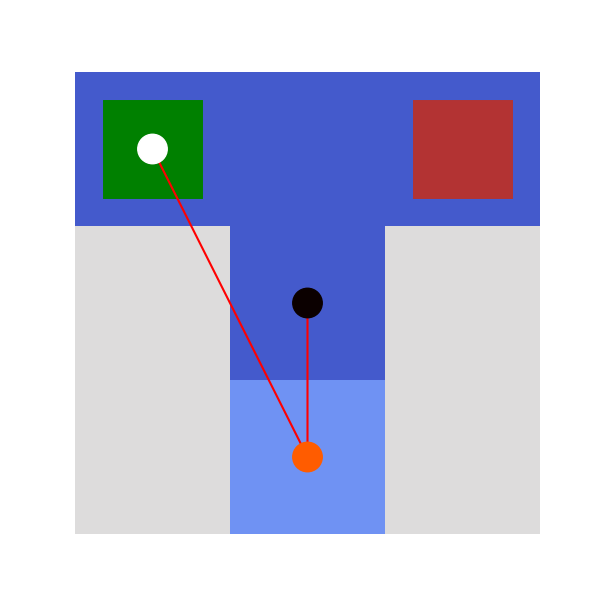

# T-Maze

## 1. The problem
In this problem, we examine an agent traversing a T-maze with three arms,
with the agent's initial position being the central location.
The bottom arm of the maze includes a cue that provides information about the probable location
of a reward in either of the two top arms, referred to as 'Left' or 'Right'.

For the implementation of this problem using ``cpp-AIF`` refer to the file [`main_Tmaze.cpp`](../../main_Tmaze.cpp).

## 2. The environment
The environment is described by the joint occurrence of two distinct 'types' of states at each time step,
which are referred to as hidden state factors.

The first hidden state factor (location) is a discrete variable with values in $(0,1,2,3)$ that encodes the agent's present location.
The four values correspond to the $( Center, Left, Right, Bottom )$ location.
For example, if the agent is in the $Bottom$ location, the current state of this factor would be $S^0 = \left\lbrack \matrix{ 0 & 0 & 0 & 1 } \right\rbrack$.

The second hidden state factor (reward condition) is a discrete variable with values in $(0,1)$ that encodes the reward condition of the trial: $( Reward\ on\ Left, Reward\ on\ Right )$. For example, a trial with the $Reward\ on\ Left$ condition would be represented as the state $S^1 = \left\lbrack \matrix{ 1 & 0} \right\rbrack$.

These two hidden state factors are independent of one another. As an example, consider a $Reward\ on\ Right$ trial and assume the agent begins in the center location. We can encode the state of the environment at the first time step using the following pair of hidden state vectors $S^0 = \left\lbrack \matrix{ 1 & 0 & 0 & 0\} \right\rbrack$ and $S^1 = \left\lbrack \matrix{ 1 & 0} \right\rbrack$. If the agent subsequently moves to the right arm, the hidden state vectors would change to $S^0 = \left\lbrack \matrix{ 0 & 1 & 0 & 0\} \right\rbrack$ and $S^1 = \left\lbrack \matrix{ 1 & 0} \right\rbrack$. This illustrates that the two hidden state factors are independent, meaning that the agent's location ($S^0$) can change without affecting the reward condition ($S^1$).

## 3. The outcome mapping

By examining the probability distributions that map from hidden states to observations, we can gain insight into the rules encoded by the environment, also known as the generative process. We refer to this collection of probabilistic relationships as the **$\bf{A}$** array.

In this T-maze demonstration, agent's observations consist of two sensory channels or observation factors describing locations and context of the specific task:
1. Location outcomes $\left\lbrack \matrix{ Cue Center & Cue Left & Cue Right & Cue Bottom\} \right\rbrack$ provide agent's position in the maze;

1. Contextual outcomes $\left\lbrack \matrix{ Cue Left & Cue Right & Reward & No Reward} \right\rbrack$ specify the reward levels and where they are deployed in the maze.

Wherever he moves in the maze, the agent gets an outcome for each observation factor. When the agent occupies the center of the maze, he observes the location $Center$, and receives a context observation that will be uninformative because equiprobable between $Cue Right$ or $Cue Left$. Otherwise, when the agent occupies the bottom location and is in $Bottom$ state, he observes unambiguously the true reward location in one of two different maze's arms. Finally, when the agent halts in one of the two maze arms he observes $Reward$ or $No Reward$ depending on whether he is in the correct arm, with a probability value set by the parameter 'a'.

<!--The $Reward$ (index 2) and $No Reward$ (index 3) observations are observed in the right and left arms of the T-maze, with associated probabilities $a$ and $b$. The variables $a$ and $b$ represent the probabilities of obtaining a reward or a loss when choosing the "correct" arm, and the probabilities of obtaining a loss or a reward when choosing the "incorrect" arm. The definition of which arm is considered "correct" or "incorrect" depends on the reward condition, which is determined by the state of the second hidden state factor.:warning:-->

In `cpp-AIF`, we use a set of `likelihood` class instances to store the set of probability distributions that encode the conditional probabilities of observations under different configurations of hidden states. Each factor-specific **$\bf{A}$** array is stored as a multidimensional array with $N_o[m]$ rows and as many lagging dimensions as there are hidden state factors. $N_o[m]$ refers to the number of observation values for observation factor $m$, i.e. **$\bf{N_o} = [4, 4]$**. Here we have two hidden state factors with sizes $4$ and $2$ respectively.

Therefore, the multidimensional arrays **$A^0$** and **$A^1$** are both 3-dimensional arrays with dimensions **$4 \times 4 \times 2$** and are the same for each action **$u$**.

We create the observation model defining a vector of vectors of objects `likelihood`. Specifically, a vector with size **$2$**, and each element will contain a vector of one object `likelihood` with size **$4 \times 4 \times 2$**.

```c++
  std::vector<std::vector<likelihood<FLOAT_TYPE,3>*>> __A;

  std::vector<likelihood<FLOAT_TYPE,3>*> _a0;
  likelihood<FLOAT_TYPE,3> __a0(4,4,2);

  std::vector<likelihood<FLOAT_TYPE,3>*> _a1;
  likelihood<FLOAT_TYPE,3> __a1(4,4,2);
```

We then fill out **$A^0$** and **$A^1$** accordingly.

```c++
  __a0.Zeros();                                                                                              
  /* cue start cue left cue right cue down */                                                                
  __a0(0,0,0)=1; __a0(1,1,0)=1; __a0(2,2,0)=1; __a0(3,3,0)=1;                                                
  /* cue start cue left cue right cue down */                                                                
  __a0(0,0,1)=1; __a0(1,1,1)=1; __a0(2,2,1)=1; __a0(3,3,1)=1;                                                
  _a0.push_back(&__a0);                                                                                      
  __A.push_back(_a0);                                                                                        
                                                                                                             
  const FLOAT_TYPE a = .9;                                                                                   
  const FLOAT_TYPE b = 1.-a;                                                                                 
                                                                                                             
  const FLOAT_TYPE d = 1.;                                                                                   
  const FLOAT_TYPE e = 1.-d;                                                                                 
                                                                                                             
  __a1.Zeros();                                                                                              
  /* CS left CS right reward positive reward negative */                                                     
  __a1(0,0,0)=0.5; __a1(0,3,0)=d; __a1(1,0,0)=0.5; __a1(1,3,0)=e;                                            
  __a1(2,1,0)=a;   __a1(2,2,0)=b; __a1(3,1,0)=b;   __a1(3,2,0)=a;                                            
  /* CS left CS right reward positive reward negative */                                                     
  __a2(0,0,1)=0.5; __a2(0,3,1)=e; __a2(1,0,1)=0.5; __a2(1,3,1)=d;                                            
  __a2(2,1,1)=b;   __a2(2,2,1)=a; __a2(3,1,1)=a;   __a2(3,2,1)=b;                                            
  _a2.push_back(&__a2);                                                                                      
  __A.push_back(_a2); 
```

## 4. Transition distribution

We represent the dynamics of the environment (e.g. changes in the location of the agent and changes to the reward condition) as conditional probability distributions. These distributions encode the likelihood of transitions between the states of a given hidden state factor being grouped together into the **$\bf{B}$** array, which is also known as transition distribution. Each matrix **$B^f$** represents the transition probabilities between state-values of a specific hidden state factor with index $f$. These matrices reflect Markovian transition probabilities that encode dynamics, such that the entry $i,j$ in a particular matrix indicates the probability of transitioning to state $i$ at time $t+1$, given that the system was in state $j$ at time $t$.

It is crucial to note that certain hidden state factors can be controlled by the agent. This means that the probability of being in state $i$ at time $t+1$ is not solely determined by the state at time $t$, but also by the actions taken (or control states) from the agent's perspective. Consequently, each transition likelihood now incorporates conditional probability distributions over states at time $t+1$, where the conditioning variables comprise both the states at time $t-1$ and the actions at time $t-1$.

For instance, in our scenario, the first hidden state factor (Location) is within the agent's control. Therefore, the corresponding transition distribution **$B^0_u$** can be accessed using both the previous state and action indices.

Being **$U = [ Move to Center, Move to Left, Move to Right, Move to Bottom ]$** (i.e. there are four actions taking the agent directly to each of the four locations), we can create the four transition distribution matrix as follows:

```c++
  std::vector<std::vector<FLOAT_TYPE>> B0_0 {
              { 1, 0, 0, 1 },
              { 0, 1, 0, 0 },
              { 0, 0, 1, 0 },
              { 0, 0, 0, 0 }
          }

  std::vector<std::vector<FLOAT_TYPE>> B0_1 {
              { 0, 0, 0, 0 },
              { 1, 1, 0, 1 },
              { 0, 0, 1, 0 },
              { 0, 0, 0, 0 },
          };

  std::vector<std::vector<FLOAT_TYPE>> B0_2 {
              { 0, 0, 0, 0 },
              { 0, 1, 0, 0 },
              { 1, 0, 1, 1 },
              { 0, 0, 0, 0 },
          };
          
  std::vector<std::vector<FLOAT_TYPE>> B0_3 {
              { 0, 0, 0, 0 },
              { 0, 1, 0, 0 },
              { 0, 0, 1, 0 },
              { 1, 0, 0, 1 },
          };
```

The transition array for the reward condition factor is a "trivial" identity matrix. This implies that the reward condition remains unchanged over time, as it is mapped from its current value to the same value in the next time step.

To account for the conditioning on factors and the conditioning on actions, we represent **$\bf{B}$** as a vector of size **$N_f$** whose each element will contain a vector of **$N_u$** (or **$1$** if the factor is uncontrollable) of `Transitions` class instances. **$N_f=2$** is the number of hidden state factors, while **$N_u=4$** is the number of control states. This `Transitions` class handles a transition distribution matrix and in order to build its own instance we can use the constructor with vector of vectors as parameter and pass it the 2D matrices previously created.

```c++
  std::vector<std::vector<Transitions<FLOAT_TYPE>*>> __B;

  std::vector<Transitions<FLOAT_TYPE>*> _b0;
  
  Transitions<FLOAT_TYPE> *__b0 = new Transitions<FLOAT_TYPE>(B0_0);                                         
  _b0.push_back(__b0)
  Transitions<FLOAT_TYPE> *__b1 = new Transitions<FLOAT_TYPE>(B0_1);                                         
  _b0.push_back(__b1);
  Transitions<FLOAT_TYPE> *__b2 = new Transitions<FLOAT_TYPE>(B0_2);                                         
  _b0.push_back(__b2);
  Transitions<FLOAT_TYPE> *__b3 = new Transitions<FLOAT_TYPE>(B0_3);                                         
  _b0.push_back(__b3)
  
  std::vector<Transitions<FLOAT_TYPE>*> _b1;                                                                 
                                                                                                             
  std::vector<std::vector<FLOAT_TYPE>> eye {                                                                 
              { 1., 0. },                                                                                    
              { 0., 1. }                                                                                     
          };
  Transitions<FLOAT_TYPE> *__b = new Transitions<FLOAT_TYPE>(eye);                                         
  _b1.push_back(__b);
  
  __B.push_back(_b0);                                                                                        
  __B.push_back(_b1);
```

## 5. The generative model

Let's move forward with setting up the generative model of the agent, which involves the agent's beliefs or assumptions regarding how hidden states generate observations and transition among themselves.

In most Markov Decision Processes (MDPs), the essential components of this generative model are the agent's representation of the observation likelihood and its representation of the transition distribution.

Assuming that the agent has an accurate representation of the rules governing the T-maze, including how hidden states lead to observations, and its ability to control its movements with predictable consequences (i.e. 'noiseless' transitions), the agent will possess a true representation of the environment's "rules," encoded in the arrays **$\bf{A}$** and **$\bf{B}$** of the generative process.

Let’s encode the agent's initial beliefs regarding its starting location and reward condition in the prior over hidden states, which is referred to as the **$\bf{D}$** array.

We have to define two arrays $D^0$ and $D^1$, each corresponding to a specific hidden state factor. We will ensure that the agent begins with precise and accurate prior beliefs about its starting location.

```c++
std::vector<FLOAT_TYPE> D0 = {1., 0., 0., 0.};
std::vector<FLOAT_TYPE> D1 = {1./2, 1./2};
```
We create the initial beliefs defining a vector of objects `Beliefs`. Specifically, a vector with size $N_f=2$, and each element will contain an object `Beliefs` with size $4$ and $2$ respectively.

```c++
  std::vector<Beliefs<FLOAT_TYPE>*> __D;                                                                     
  Beliefs<FLOAT_TYPE> *d0 = new Beliefs<FLOAT_TYPE>(D0);                                                     
  __D.push_back(d0);                                                                                         
  Beliefs<FLOAT_TYPE> *d1 = new Beliefs<FLOAT_TYPE>(D1);                                                     
  __D.push_back(d1);
```

To ensure that the agent is motivated to choose the arm that maximizes the probability of receiving a reward, we need to give the agent a sense of reward and loss. We can achieve this by setting up the **$\bf{C}$** array, which represents the agent's prior preferences for each observation factor. We initialize the $C^0$ array to all 1s, indicating that the agent has no preference for any particular outcomes. Instead, since the second factor is the Reward modality, with the $Reward$ outcome having an index of 2 and the $No Reward$ outcome having an index of 3, we can assign values to the corresponding entries that reflect the relative preference for one outcome over the other. Specifically, we use relative log-probabilities to encode these preferences.

```c++
  std::vector<FLOAT_TYPE> C0 = {1., 1., 1., 1.};                                                             
  softmax<FLOAT_TYPE>(C0)
  const FLOAT_TYPE c = 2.;
  std::vector<FLOAT_TYPE> C1 = {0., 0., c, -c};                                                              
  softmax<FLOAT_TYPE>(C1);
```

The ability to modify the agent's prior beliefs and bias it towards observing the $Reward$ outcome more often than the $No Reward$ outcome is what gives the Reward modality its intrinsic value. Without this bias, the Reward modality would be no different from any other arbitrary observation. Applying [`softmax`](../utils.md#softmax) to $C^0$ and $C^1$ guarantees that the prior preferences will be in a range of 0 and 1, and the sum of them is 1, thus the preferences are interpretable as a percentage rate for each outcome. 

In order to set up the state of the environment at the first time step in a $Reward\ on\ Left$ trial assuming the agent starts in the $Center$ location, we define a vector of two `States` objects, one for each factor.

```c++
  unsigned int context = 0;
  std::vector<States*> __S;
  States *s0 = new States(T);
  s0->Zeros();
  s0->Set(0);
  __S.push_back(s0);
  States *s1 = new States(T);
  s1->Zeros();
  s1->Set(context);
  __S.push_back(s1)
```

`s0` refers to the location, while `s1` refers to the reward condition. We initialize them to all 0s, and then we use the `Set` method to assign the corresponding true initial state at time step $0$.

## 6. Policies

We can either create an empty vector of policies and in this case the constructor will generate the policies, or we can build our own vector of policies, for example:

```c++
  std::vector<std::vector<int>> V {                                                                        
    { 0,  0,  0,  0,  1,  1,  1,  1,  2,  2,  2,  2,  3,  3,  3,  3 },                                     
    { 0,  1,  2,  3,  0,  1,  2,  3,  0,  1,  2,  3,  0,  1,  2,  3 },                                     
    { 0,  1,  2,  3,  0,  1,  2,  3,  0,  1,  2,  3,  0,  1,  2,  3 }                                      
  }
```

`V` is a vector of vectors of  `int` with size **$(num\\_timesteps, num\\_policies)$** where **$num\\_timesteps$** is the temporal depth of the policy and **$num\\_policies$** is the number of policies.

## 7. Introducing the `MDP` class

Within `cpp-AIF`, we have abstracted many of the computations necessary for active inference into the `MDP` class. This flexible object can be used to store essential elements of the generative model, the agent's current observations and actions, and execute action/perception through functions like `infer_states` and `infer_policies`.

To create an instance of the `MDP`, simply call the `MDP` constructor with a list of arguments.

```c++
int seed = 0;
unsigned int T = 3;
MDP<FLOAT_TYPE,3> *mdp = new MDP<FLOAT_TYPE,3>(__D,__S,__B,__A,__C,V,T,64,4,1./4,1,4,seed);
```

## 8. Active Inference

We can use the basic active inference  procedure implemented as `MDP` class method

```c++
template <typename Ty, std::size_t M>
void MDP<Ty,M>::active_inference()
{
  unsigned int tt = 0;
  while (tt < T)
  {
    infer_states(tt);

    /* value of policies (G) */
    std::vector<Ty> G = infer_policies(tt);

    /* next action (the action that minimises expected free energy) */
    int a = sample_action(tt);

    /* sampling of next state (outcome) */
    if (tt < T-1)
    {
      /* next sampled state */
      sample_state(tt+1, a);

      /* next observed state */
      sample_observation(tt+1, a);
    }

    tt += 1;
  }
}
```

calling it in the main like this:

```c++
mdp->active_inference();
```

Simulation of T-maze

In this environment, a mouse is positioned at the center of a T-maze, faced with multiple choices. It can either move to the right or left arms, both of which can contain cheese, or head to the lower arm, which provides information about the cheese's location. The mouse is limited to two moves; once it enters the right or left arms, it cannot leave (i.e., these are absorbing states). Therefore, the most favorable strategy is to first explore the lower arm for reward information and then proceed to collect the reward. Based on this strategy, the rodent gets a rewarding stimulus proportional to the prior preference parameter $c$ if the mouse reaches the correct cheese location, while it gets an aversive stimulus proportional to the penalty parameter $-c$. In the lower arm, there is a conditioned stimulus that specifies which is the arm with the cheese; it has not neither a rewarding nor aversive stimulus.

Simulations show that the active inference agent modeling rodent balances the pursuit of information (e.g., heading to the cue at time-step 2) and the pursuit of extrinsic value (e.g., collecting the cheese in the left arm at time-step 3). Notably, this behavior might not be exhibited by agents following the optimal Bayes design that conversely pursues maximizing information, preferring to resolve uncertainties about the task context by reaching the cue in the lower arm and staying until the end of the trial. Neither an agent designed to maximize the utility gained, e.g., as in Bayesian decision theory or reinforcement learning, would have the same strategy: it, instead, would linger in its starting position until time step 2 after which it would move indifferently to one of the two upper arms. This behavior stems from the agent's indifference to the information gained that entails remaining at the central location.

In the Figure, results of a simulation trial with the reward placed at left arm.

<figure>
  Figure 1.</figcaption>
</figure>
